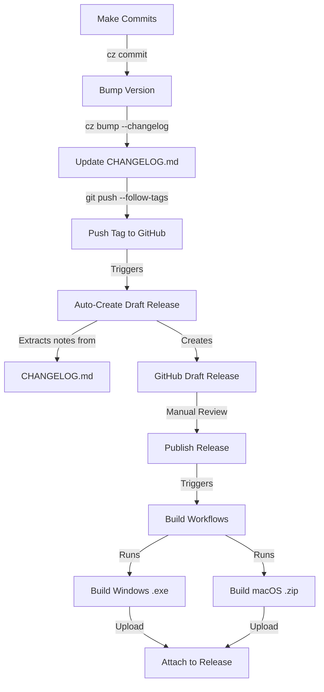

# Automated Release Workflow

This document describes the automated release process for ClawdBot Control Panel.

## Overview

The release workflow is fully automated and follows these steps:

1. **Make commits** using conventional commit format
2. **Bump version** and update changelog
3. **Push tag** to trigger draft release
4. **Review and publish** the draft release on GitHub
5. **Builds automatically** and attaches executables to the release

## Workflow Architecture



## Step-by-Step Process

### 1. Make Commits

Use conventional commits for all changes:

```bash
# Feature commits
cz commit

# Or manually:
git commit -m "feat: add new dashboard widget"
git commit -m "fix: resolve gateway connection issue"
git commit -m "docs: update installation guide"
```

### 2. Bump Version

When ready to release, bump the version:

```bash
# This will:
# - Analyze commits since last version
# - Determine version bump (major/minor/patch)
# - Update version in pyproject.toml
# - Generate CHANGELOG.md entry
# - Create a git tag
cz bump --changelog
```

### 3. Push Changes

Push your commits and the new tag:

```bash
# Push commits and tags together
git push --follow-tags
```

### 4. Draft Release Created Automatically

When the tag is pushed, the **Auto-Create Draft Release** workflow runs:

- **Workflow**: `.github/workflows/auto-draft-release.yml`
- **Trigger**: Any `v*` tag (e.g., `v1.0.0`, `v1.2.3`)
- **Actions**:
  1. Extracts version from tag
  2. Reads corresponding section from `CHANGELOG.md`
  3. Creates a **draft release** on GitHub with:
     - Title: `ClawdBot Control Panel v1.0.0`
     - Body: Content from CHANGELOG.md
     - Status: **Draft** (not published)

### 5. Review and Publish

1. Go to GitHub Releases page
2. Find the draft release
3. Review the release notes
4. Edit if needed (add screenshots, additional notes, etc.)
5. Click **Publish release**

### 6. Builds Triggered Automatically

When you publish the release, the **Publish Release** workflow runs:

- **Workflow**: `.github/workflows/publish.yml`
- **Trigger**: Release published
- **Actions**:
  1. Extracts version from release tag
  2. Runs Windows build workflow
  3. Runs macOS build workflow
  4. Uploads both executables to the release

#### Build Workflows

**Windows Build** (`.github/workflows/build-windows.yml`):
- Builds using Nuitka on Windows runner
- Creates: `ClawdBot-Control-Panel-v1.0.0-Windows.exe`
- Uploads as artifact

**macOS Build** (`.github/workflows/build-macos.yml`):
- Builds using Nuitka on macOS runner
- Creates `.app` bundle and zips it
- Creates: `ClawdBot-Control-Panel-v1.0.0-macOS.zip`
- Uploads as artifact

**Upload Assets** (`.github/workflows/upload-assets.yml`):
- Downloads both build artifacts
- Attaches them to the published release

## Example Complete Workflow

```bash
# 1. Make changes
git add .
cz commit  # Select type: feat, fix, etc.

# 2. Make more changes
git add .
cz commit

# 3. When ready to release
cz bump --changelog

# Output will show:
# bump: version 1.0.0 → 1.1.0
# tag to create: v1.1.0
# [master abc123] bump: version 1.0.0 → 1.1.0

# 4. Push everything
git push --follow-tags

# 5. Check GitHub:
# - Draft release created automatically with CHANGELOG.md content
# - Review the draft

# 6. Publish the draft release on GitHub UI

# 7. Wait for builds to complete (~5-10 minutes)
# - Windows .exe and macOS .zip will be attached automatically
```

## Workflow Files

| File | Purpose | Trigger |
|------|---------|---------|
| `auto-draft-release.yml` | Creates draft release from CHANGELOG.md | Tag push (`v*`) |
| `publish.yml` | Orchestrates build workflows | Release published |
| `build-windows.yml` | Builds Windows executable | Called by publish.yml |
| `build-macos.yml` | Builds macOS application | Called by publish.yml |
| `upload-assets.yml` | Uploads artifacts to release | Called by publish.yml |

## CHANGELOG.md Format

The `CHANGELOG.md` must follow this format for automatic extraction:

```markdown
# Changelog

All notable changes to ClawdBot Control Panel will be documented in this file.

## v1.1.0 (2026-01-27)

### Feat

- add new dashboard widget
- implement auto-save feature

### Fix

- resolve gateway connection timeout
- fix settings page layout

## v1.0.0 (2026-01-26)

### Feat

- initial release
- add core features
```

The workflow extracts content between `## v1.1.0` and the next `## v` header.

## Troubleshooting

### Draft release not created

- **Check**: Tag format must be `v*` (e.g., `v1.0.0`, not `1.0.0`)
- **Check**: CHANGELOG.md has a section for that version
- **Fix**: Push tag again or create draft manually

### Builds failed

- **Check**: Workflow logs in GitHub Actions
- **Common issues**:
  - Nuitka compilation errors
  - Missing dependencies
  - Icon file not found

### Assets not uploaded

- **Check**: Both build-windows and build-macos completed successfully
- **Check**: Artifacts were created (check workflow artifacts tab)
- **Fix**: Re-run failed jobs in GitHub Actions

## Benefits

✅ **Automatic draft creation**: No manual copying of CHANGELOG.md  
✅ **Review before builds**: Review draft before triggering expensive builds  
✅ **Clean release notes**: Structured notes from CHANGELOG.md  
✅ **Platform-specific builds**: Separate Windows and macOS workflows  
✅ **Automatic asset upload**: Executables attached without manual intervention  
✅ **Conventional commits**: Semantic versioning enforced  

## Comparison: Old vs New Workflow

### Old Workflow ❌

1. Run `cz bump --changelog`
2. Push commits and tags
3. **Manually create** draft release on GitHub
4. **Manually copy** CHANGELOG.md content
5. **Manually publish** release
6. Builds run and attach assets

### New Workflow ✅

1. Run `cz bump --changelog`
2. Push commits and tags
3. **Draft auto-created** with CHANGELOG.md content
4. Review and publish draft
5. Builds run and attach assets

**Time saved**: ~2-3 minutes per release  
**Errors reduced**: No manual copy-paste mistakes
